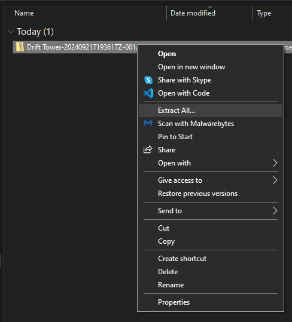
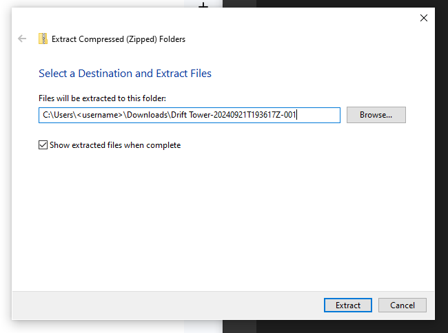
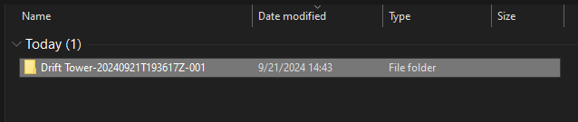
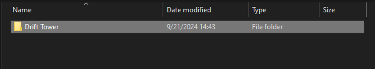
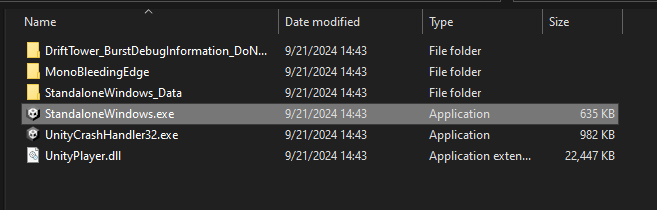
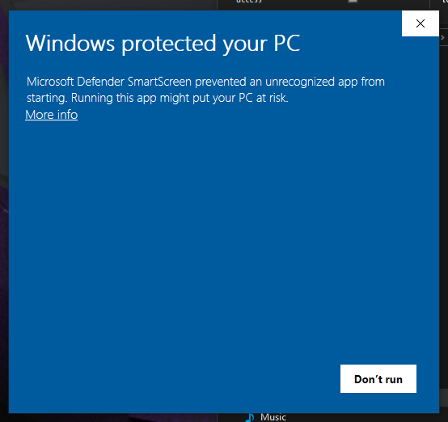
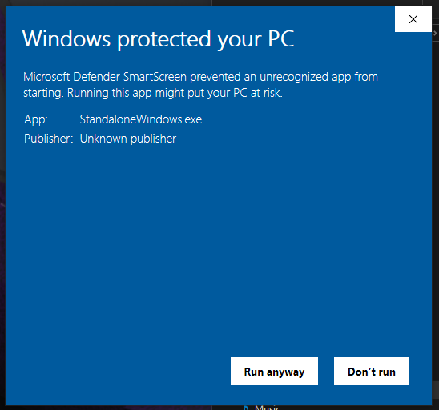

# Install
This is a guide on installing Drift Tower.

## Download
Download Drift Tower at the google drive link below.  
Click the kebab menu 'More actions' on Drift Tower folder and select download.
[Download Drift Tower](https://drive.google.com/drive/folders/1HuUb8lbFDDSiieL5Ijr9Mj2gOepMPdPc?usp=sharing)

## Install
### 1. Extract All... on Drift Tower zip folder.

### 2. Select extraction location

### 3. Open the extracted folder

### 4. Open Drift Tower folder

### 5. Open 'StandaloneWindows.exe' to launch.

### 6. Bypass windows warning by clicking 'More info'

### 7. Click Run Anyway

## Documentation Links
### [1. Summary](../1.Summary/summary.md)
### [2. Install](./install.md)
### [3. Uninstall](../3.Uninstall/uninstall.md)
### [4. Controls](../4.Controls/controls.md)
### [9. ChangeLogs](../9.ChangeLogs/changeLogs.md)