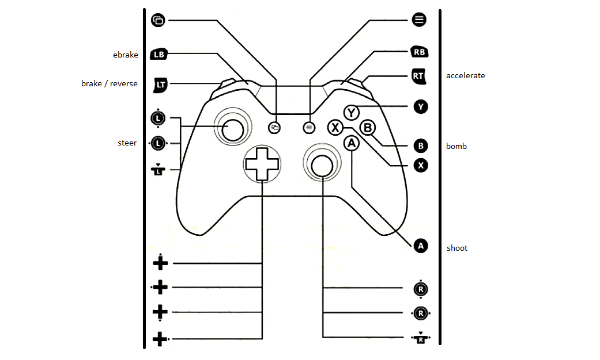

# Controls

## Controller (Preferred)

| Button | Description |
| ----------- | ----------- |
| Left Stick Horizontal | steer |
| Right Trigger | accelerate |
| Left Trigger  | brake |
| Left Bumper | ebrake |
| Button East | bomb |
| Button South | shoot |

## Keybaord and Moused (Not Preferred)

| Button | Description |
| ----------- | ----------- |
| a | steer left |
| d | steer right |
| s | brake |
| w | accelerate |
| right click | ebrake |
| f | bomb |
| left click  | shoot |

## Documentation Links
### [1. Summary](../1.Summary/summary.md)
### [2. Install](../2.Install/install.md)
### [3. Uninstall](../3.Uninstall/uninstall.md)
### [4. Controls](./controls.md)
### [9. ChangeLogs](../9.ChangeLogs/changeLogs.md)